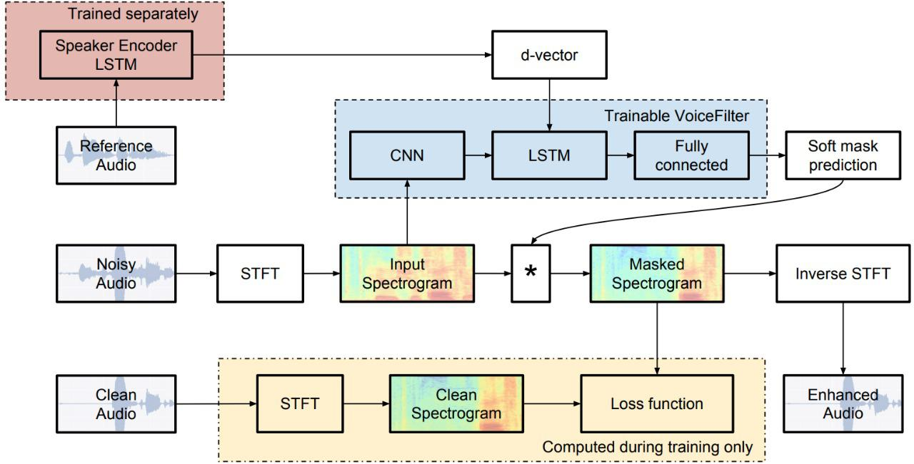
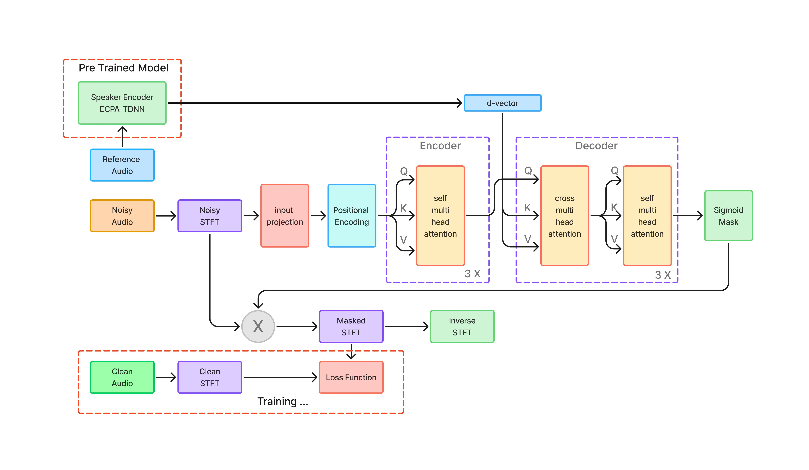

# Audio Enhancement System

Real-time Target Speech Enhancement and Noise Reduction

## Overview

This project implements a deep learning based **Target Speech Enhancement (TSE)** system designed to isolate and enhance a specific speaker's voice from noisy environments. The system improves speech intelligibility and quality in scenarios such as online meetings, voice communication, and real-world audio recordings.

Traditional speech enhancement methods struggle in complex acoustic environments containing multiple speakers and non-stationary noise. This project addresses that limitation by combining **time-frequency signal processing with modern deep learning architectures**, enabling robust speech enhancement in realistic settings. 

The system was developed using the **URGENT 2025 Speech Enhancement Challenge dataset** and aims to surpass the provided baseline model while maintaining real-time performance.

---

# Problem Statement

In real-world environments such as meetings, online classes, or voice calls, speech signals are often degraded by background noise and overlapping speakers. Existing deep learning approaches frequently perform well in controlled environments but struggle when exposed to diverse acoustic conditions.

Many commercial tools require powerful GPUs or subscription services, limiting accessibility. This project focuses on developing a **lightweight, real-time target speech enhancement system** capable of running on consumer hardware while improving speech clarity and intelligibility. 

---

# Objectives

### Main Objectives

* Develop a **real-time target speech enhancement model**
* Train and evaluate the system on the **URGENT 2025 Track 1 dataset**
* Improve performance over the provided **CNN-STFT-LSTM baseline**
* Deploy the model in a **user-friendly application**
* Maintain accessibility by minimizing dependency on high-end GPUs

### Sub Objectives

* Optimize models using pruning and quantization
* Improve robustness across unseen noisy environments
* Design an intuitive interface for real-time usage
* Evaluate both objective and subjective speech quality improvements

---

# Dataset

The project uses the **URGENT 2025 Challenge Track 1 dataset**, which contains:

* ~2.5k hours of speech recordings
* ~0.5k hours of noise samples

### Preprocessing

The following preprocessing steps are applied:

* Audio resampling to **16 kHz**
* Short Time Fourier Transform (STFT)
* Voice Activity Detection
* Audio normalization
* Data augmentation (noise mixing, pitch shifting, reverberation)

These steps ensure consistency and improve model generalization. 

---

# System Architecture

The system follows a modular pipeline composed of six stages.

1. Input Module
   Accepts recorded or uploaded audio.

2. Preprocessing Module
   Performs normalization, segmentation, and STFT conversion.

3. Feature Extraction Module
   Generates spectrogram features and speaker embeddings.

4. Transformer Enhancement Module
   Core deep learning model responsible for noise reduction and speech isolation.

5. Post Processing Module
   Reconstructs waveform using inverse STFT.

6. Output Module
   Returns enhanced audio to the user.

This modular architecture ensures scalability and easy integration with future models. 

---

# Model Architecture

## Baseline Model (CNN + STFT + LSTM)

## Transformer-Based Model

The initial baseline architecture consists of:

* Convolutional Neural Networks (CNN)
* Short Time Fourier Transform (STFT)
* Long Short Term Memory (LSTM)

CNN layers extract local features while LSTM layers model temporal dependencies.

However, the baseline struggles with overlapping speakers and complex noise environments.

---

## Proposed Transformer Based Model

To improve performance, the system incorporates a **Transformer-Conformer hybrid architecture**.

Key features include:

* Self attention mechanism for long range dependencies
* Dual path architecture for efficient temporal modeling
* Positional encoding to retain sequence information
* Lightweight design optimized for real-time inference
* Streaming processing for low latency

The model is trained end-to-end using PyTorch with combined time-domain and frequency-domain losses. 

---

# Training Configuration

Loss Functions

* Signal to Distortion Ratio (SDR)
* Waveform loss
* Magnitude loss

Optimizer
AdamW with learning rate scheduling

Training Setup

Batch size: 8
Epochs: 100
Learning rate: 1e-4
Audio segment length: 4 seconds

The proposed model achieves approximately **+1.8 dB improvement in SDR compared to the baseline model**. 

---

# Evaluation Metrics

Performance is evaluated using:

* SDR (Signal to Distortion Ratio)
* PESQ (Perceptual Evaluation of Speech Quality)
* STOI (Short Time Objective Intelligibility)

The system was also tested on unseen noise conditions including:

* crowd noise
* street ambience
* reverberant indoor environments

Real-time inference latency remains below **150 ms**, making the system suitable for live applications. 

---

# System Interface

The application includes a lightweight user interface.

Users can:

1. Upload or record audio
2. Run the speech enhancement model
3. Listen to enhanced output
4. Download the processed audio

### Tech Stack

Python
PyTorch
Torchaudio
Streamlit
FastAPI
Docker

The system supports both **local and cloud deployment**.

---

# Applications

The system can be applied in multiple domains including:

* Online meetings and video conferencing
* Voice communication platforms
* Customer support systems
* Hearing assistance technologies
* Audio recording and broadcasting
* Gaming voice chat enhancement

---

# Hardware Requirements

Minimum system requirements:

Processor: Intel i5 or higher
RAM: 8 GB
GPU: Optional (required for training)
Storage: ~20 GB

---

# Future Work

Potential improvements include:

* Diffusion based speech enhancement models
* Multimodal speech enhancement using lip cues
* Personalized speaker embeddings
* Mobile and browser based deployment
* Further latency optimization

---
## Contributors

- Rhythm Kachhwaha
- Mayank Saini
- Nishant Singh
- Lakshya Gupta

**Project Guide:**  
Dr. Amit Ranjan  

**Institution:**  
University of Petroleum and Energy Studies

---

